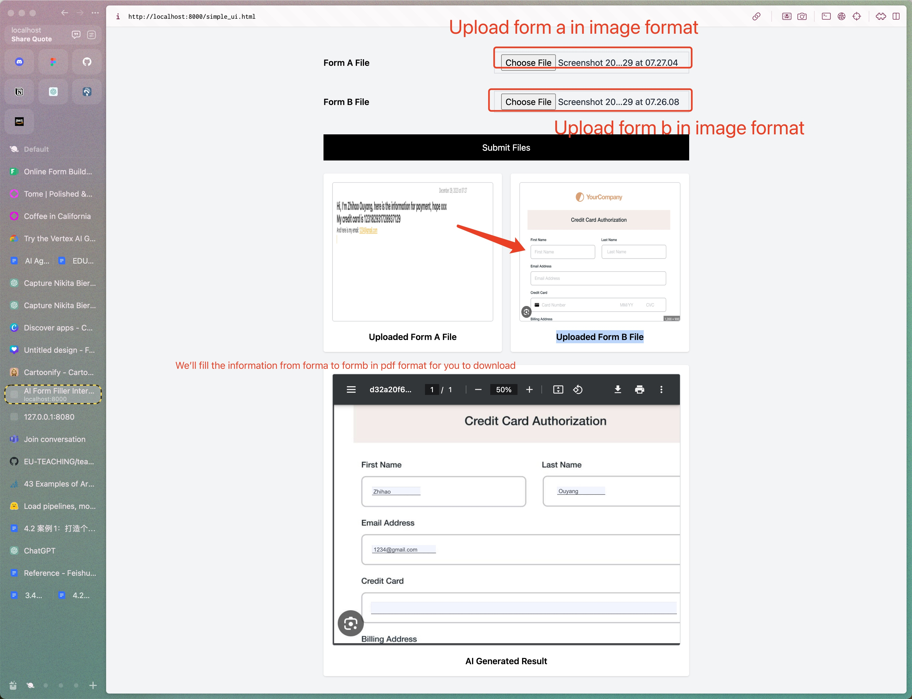

# QuickFill

QuickFill is an AI-powered form-filling application that simplifies the process of filling out forms by using image uploads. It leverages GPT-4 Vision and AWS OCR technology to extract information from provided images and fill the forms accurately.

Currently we only support English due to the AWS TextExtractor only support En.



## Installation

To get started with QuickFill, you need to set up the application on your local environment. Follow these steps:

```bash
cd quickfill
pip install -r requirements.txt
```

## API Key

Before using QuickFill, you need to configure your OpenAI and AWS credentials. These keys are essential for the application to function properly.

1. OpenAI API Key: Set up your OpenAI API key to enable GPT-4 Vision capabilities.
2. AWS Access Key: Configure your AWS access key to use AWS OCR services.
Eg: Make sure you can access AWS TextExtraction Service.
You might want to use the following command to setup AWS env
```aws
pip install boto3
pip install awscli
aws configure
```
Feel free to check the https://chat.openai.com/share/588c9fbd-c783-4276-9db3-43da8e4288de
or search "How to setup AWS" at AWS official website.

## Quickstart

To launch QuickFill, navigate to the application's directory and run the provided script. Then, access the application through your web browser:

```bash
# Start the backend
sh run.sh

# Start the frontend
cd quickfill/ui
python3 -m http.server

# Open the demo
## This one use the GPT4-Vision
http://localhost:8000

## This one uses the AWS OCR service
http://localhost:8000/ocr_fill.html
```

## Frontend

The frontend code for QuickFill is located in the following directory:

```
quickfill/frontend/index.html
```

You can modify the frontend as per your needs.

## Functionality

QuickFill mainly functions through two image uploads:

- **Image A**: Upload an image containing the information from the user.
- **Image B**: Upload an image of the target form that needs to be filled.

## Technology Stack

- **GPT-4 Vision**: Utilized for advanced image processing and understanding.
- **AWS OCR**: Employed for Optical Character Recognition to accurately extract text from images.

## Limitations

Currently, QuickFill only supports English, due to the reliance on AWS OCR services. This limitation is necessary to ensure accurate location and filling of the forms.

## Citation

If you use QuickFill in your research or project, please cite the following paper:

```bibtex
@article{quickfill2024,
  title={Quickfill: AI form filling tech},
  author={Zhihao Ouyang, Haowen Guo},
  journal={github},
  year={2024}
}
```

Thank you for choosing QuickFill!

