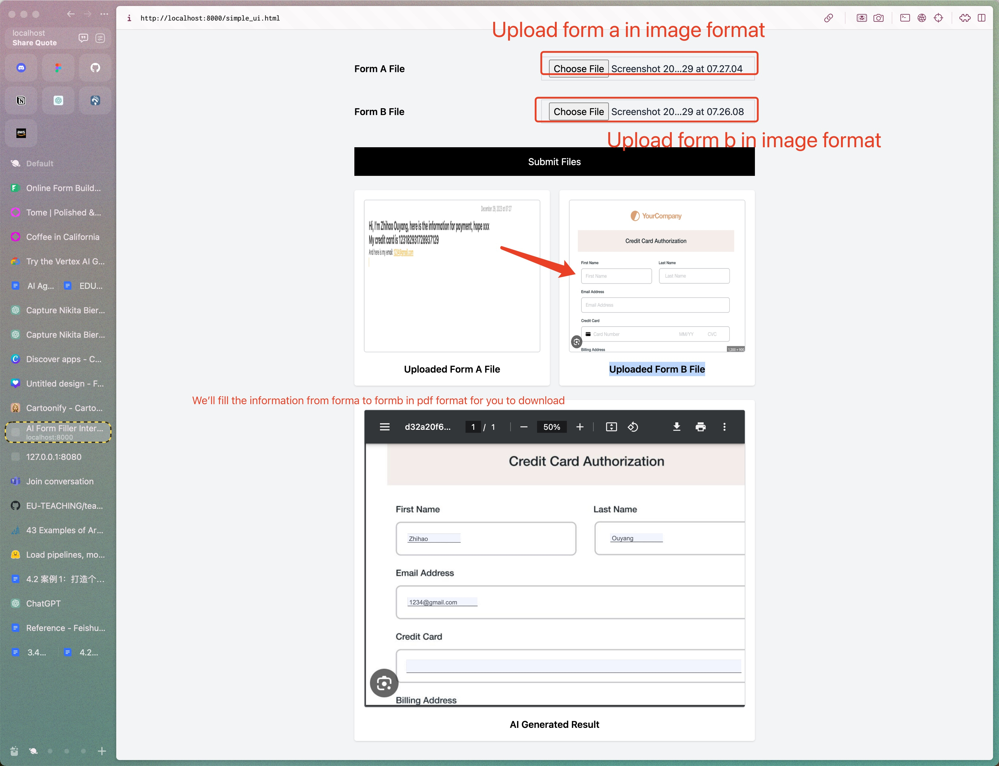

# Quickfill
Quickfill.ai is a opensource tool that helps you handle form filling tasks.
Currently we only support English due to the AWS TextExtractor only support En.



# Quick start
```bash
cd quickfill
pip install -r requirements.txt
# Start the backend
sh run.sh

# Start the frontend
cd quickfill/ui
python3 -m http.server

# Open the demo
## This one use the GPT4-Vision
http://localhost:8000

## This one uses the AWS OCR service
http://localhost:8000/ocr_fill.html
```

## AWS
Make sure you can access AWS TextExtraction Service.
Eg:
```aws
pip install boto3
pip install awscli
aws configure
```
Feel free to check the https://chat.openai.com/share/588c9fbd-c783-4276-9db3-43da8e4288de
or search "How to setup AWS" at AWS official website.

